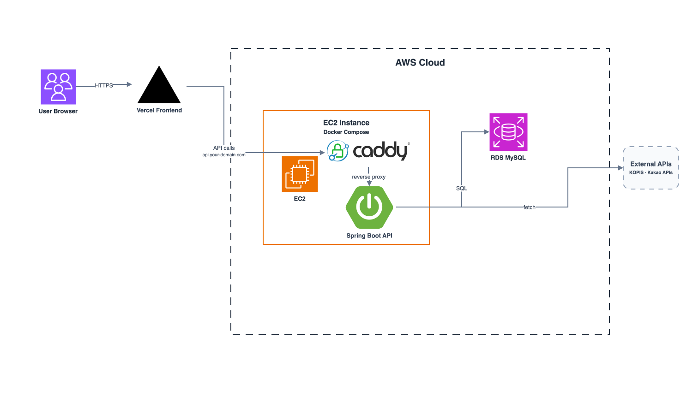

# Concert Buddy Backend

공연 전후 시간을 함께 보낼 동행을 찾고, 방장이 일정과 장소를 관리할 수 있도록 돕는 Concert Buddy의 Spring Boot 백엔드입니다.

[API 서버](https://api.boostad.site/api/health) |
[Swagger UI](https://api.boostad.site/swagger-ui/index.html) |
[OpenAPI JSON](https://api.boostad.site/v3/api-docs)

## 서비스 소개

Concert Buddy는 공연을 보러 가는 사용자가 같은 공연을 보는 사람들과 방을 만들고, 입장 전후 일정과 장소를 함께 조율할 수 있도록 돕는 모바일 웹 서비스입니다.

백엔드는 아래 흐름을 담당합니다.

- Kakao OAuth 기반 로그인과 서비스 JWT 발급
- 닉네임, 연령대, 성별 기반 프로필 완료 처리
- KOPIS 기반 공연 데이터 적재와 공연 검색
- 공연별 방 생성, 참여 요청, 승인, 오픈채팅 접근 제어
- Kakao Local 기반 장소 검색과 좌표 변환
- 방별 일정 타임라인, 지도 데이터, 일정 draft 저장 흐름

## 백엔드 주요 기능

| 영역 | 기능 |
| --- | --- |
| 인증 | Kakao OAuth, JWT bearer 인증, 프로필 완료 guard |
| 공연 | KOPIS 초기 적재, 공연 목록/상세 조회, 공연별 관심 태그 |
| 방 | 방 생성/조회, 참여 신청, 승인/거절, 오픈채팅 링크 접근 제어 |
| 장소 | Kakao Local 장소 검색, 주소 좌표 변환, 장소 upsert |
| 일정 | 타임라인 조회, 지도 bounds 조회, 일정 draft 미리보기/확정 |
| 운영 | 공통 응답 envelope, 전역 예외 처리, Swagger/OpenAPI, Flyway migration |

## 시스템 흐름



Spring Boot 애플리케이션은 외부에 직접 8080 포트를 열지 않고, EC2의 Caddy가 HTTPS 요청을 받아 Docker network 내부의 app container로 전달합니다.

## 기술 스택

| 구분 | 기술 |
| --- | --- |
| Language | Java 17 |
| Framework | Spring Boot, Spring Web, Spring Security |
| Database | MySQL, H2(test), Spring Data JPA, Flyway |
| API 문서 | springdoc-openapi, Swagger UI |
| Infra | Docker, Docker Compose, Caddy, AWS EC2, AWS RDS |
| External API | Kakao OAuth, Kakao Local, KOPIS Open API |
| Test | JUnit 5, Spring Boot Test |

## 빠른 시작

### 요구사항

- Java 17
- Docker 또는 Colima
- Git

macOS에서 기본 Java 버전이 Gradle wrapper와 맞지 않으면 아래처럼 Java 17을 명시합니다.

```bash
JAVA_HOME=$(/usr/libexec/java_home -v 17) ./gradlew test
```

### 환경 변수 준비

```bash
cp .env.example .env
```

`.env`에는 실제 비밀값을 넣을 수 있지만, `.env` 자체는 Git에 커밋하지 않습니다.

### 로컬 MySQL 실행

```bash
docker compose up -d mysql
```

### 애플리케이션 실행

```bash
JAVA_HOME=$(/usr/libexec/java_home -v 17) ./gradlew bootRun
```

### 헬스 체크

```bash
curl http://localhost:8080/api/health
```

정상 응답:

```json
{
  "isSuccess": true,
  "code": "COMMON200",
  "message": "요청에 성공했습니다.",
  "result": {
    "status": "UP"
  }
}
```

### Swagger

```text
http://localhost:8080/swagger-ui/index.html
```

## 환경 변수

실제 값은 `.env`, EC2의 `.env.prod`, GitHub Secrets 같은 안전한 위치에만 둡니다. README, PR, Wiki, Slack에 실제 secret을 적지 않습니다.

| 변수 | 용도 | 관리 방식 |
| --- | --- | --- |
| `JWT_SECRET_KEY` | 서비스 JWT 서명 키 | secret |
| `JWT_ACCESS_EXPIRATION` | access token 만료 시간 | 설정값 |
| `DB_URL` | MySQL/RDS JDBC URL | secret |
| `DB_USERNAME` | DB 사용자명 | secret |
| `DB_PASSWORD` | DB 비밀번호 | secret |
| `CORS_ALLOWED_ORIGINS` | FE origin allowlist | 설정값 |
| `KAKAO_CLIENT_ID` | Kakao REST API 키, OAuth token 교환에 사용 | FE OAuth client_id로도 공유 |
| `KAKAO_CLIENT_SECRET` | Kakao client secret | secret |
| `KAKAO_ALLOWED_REDIRECT_URIS` | OAuth redirect URI allowlist | 설정값 |
| `KAKAO_LOCAL_REST_API_KEY` | Kakao Local 장소 검색/주소 변환에 사용 | 서버 env로 관리 |
| `KOPIS_SERVICE_KEY` | KOPIS Open API key | secret |
| `KOPIS_INITIAL_IMPORT_*` | KOPIS 초기 적재 설정 | 설정값 |

Kakao 로그인에서 FE는 REST API 키를 `client_id`로 사용하고, BE는 전달받은 `code`를 Kakao token으로 교환합니다. 자세한 FE 연동 방식은 [FE 연동 가이드](docs/fe-integration-guide.md)를 확인합니다.

## 데이터베이스와 마이그레이션

Flyway는 아래 경로의 versioned SQL migration을 실행합니다.

```text
src/main/resources/db/migration
```

로컬 개발은 Docker MySQL을 사용하고, 테스트는 H2 기반 `test` profile을 사용합니다. 운영은 `prod` profile에서 RDS MySQL에 연결합니다.

## 배포

운영 배포는 EC2에서 Docker Compose로 `app`과 `caddy` container를 실행하는 구조입니다.

- Caddy: 80/443 수신, HTTPS, reverse proxy
- App: Spring Boot API, Docker 내부 8080
- RDS: MySQL 영속 데이터

자세한 서버 설정과 배포 명령은 [EC2 배포 가이드](docs/deploy-ec2.md)를 확인합니다.

## 문서

| 문서 | 용도 |
| --- | --- |
| [FE 연동 가이드](docs/fe-integration-guide.md) | FE 개발자가 Kakao OAuth, JWT, 프로필 완료, 지도/장소 API를 붙일 때 보는 문서 |
| [EC2 배포 가이드](docs/deploy-ec2.md) | EC2, Docker Compose, Caddy, RDS 기반 배포/운영 문서 |
| [트러블슈팅](docs/troubleshooting.md) | CORS, Kakao OAuth, Docker, Caddy, KOPIS 등 자주 겪은 문제 해결 |

서비스 소개, 아키텍처 결정, 외부 API 연동 회고, CodeRabbit 리뷰에서 얻은 교훈은 GitHub Wiki로 분리해 정리합니다.

## 테스트

```bash
JAVA_HOME=$(/usr/libexec/java_home -v 17) ./gradlew test
```

테스트는 `test` profile과 H2를 사용하므로 Docker MySQL 없이 실행할 수 있습니다.

## 현재 MVP 범위

- Kakao OAuth 로그인과 JWT 인증
- 프로필 완료 상태 기반 API 접근 제어
- KOPIS 기반 공연 데이터 cache와 공연 검색
- 공연별 방 생성과 참여 요청/승인
- Kakao Local 기반 장소 검색과 좌표 변환
- 방별 일정 타임라인/지도/draft 저장 API
- EC2, Caddy, Docker, RDS 기반 배포

추억방, 미디어 업로드, 알림, 고도화된 경로/소요시간 계산은 MVP 이후 범위로 둡니다.
